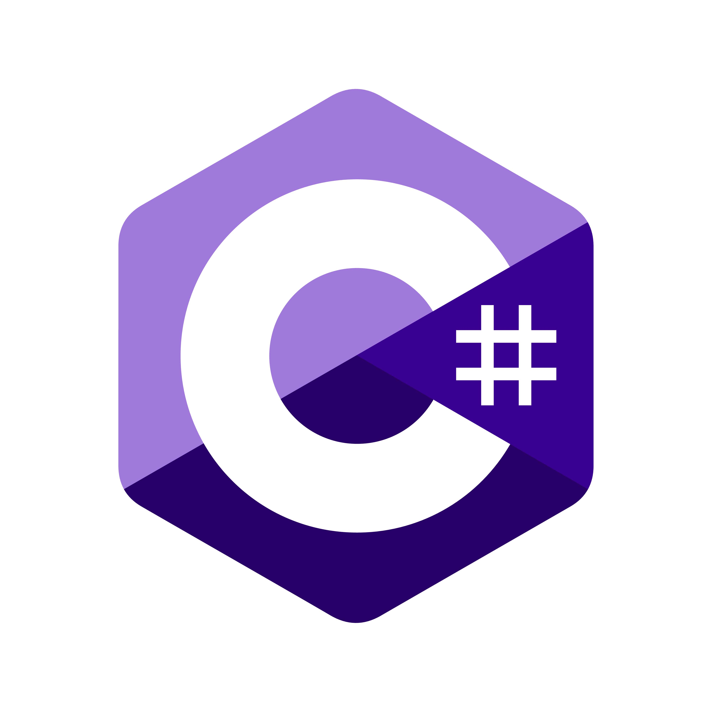

<br/>
<p align="center">
    <a href="https://github.com/TheArchitect123"></a>
</p>

<p align="center">
The C# implementation for the XRP Ledger. Upload smart contracts, data, or anything to the XRP Blockchain.
</p>
<br/>

<p align="center">
  <a href="https://xrpl.org/docs.html">
  
  </a>
  
  <a href="">
  
  </a>
</p>

<p align="center">
  <a href="https://xrpl.org/docs.html"><strong>Explore the Docs »</strong></a>
  <br />
  <br/>
  <a href="https://xrpl.org/docs.html">Example App</a>
  ·
  <a href="https://xrpl.org/docs.html">API Reference</a>
  ·
  <a href="https://xrpl.org/docs.html">Nuget Package</a>
  ·
  <a href="https://xrpl.org/docs.html">GitHub</a>
</p>

## Features

- **Written in C#**, with type definitions
- Works with Xamarin, Unity, Asp, and all other frameworks in the .Net Ecosystems

## Installation & Configuration

Grab the latest version off [NuGet](https://www.nuget.org/packages/XRPNet.Ledger)

```sh
dotnet add package XRPNet.Ledger
```

## Usage

This package can be used for Mobile & Web Developers, or SDK Developers looking to extend the XRP Blockchain

## XRPNet.Ledger For Unity Developers

If you are using XRPNet.Ledger for Unity, please make sure to install the [following asset](https://github.com/XRPNet.Ledger) in your project, and follow the installation instructions above

## License

This software is licensed under the MIT license. See [LICENSE](./LICENSE) for full disclosure.
